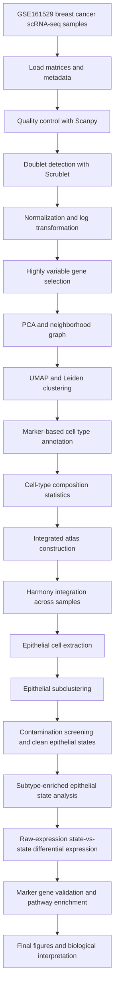

# scRNA_BreastCancer_Atlas

Integrated single-cell RNA-seq analysis of human breast cancer samples from normal breast tissue, BRCA1 preneoplastic tissue, ER-positive breast cancer, HER2-positive breast cancer, triple-negative breast cancer (TNBC), and metastatic ER-positive disease. The project builds a reproducible Python/Scanpy workflow for quality control, doublet filtering, cell-type annotation, integrated atlas construction, epithelial tumor-state discovery, differential expression, pathway analysis, and biological validation.

This repository is designed as a GitHub-ready portfolio and research workflow. Large raw/intermediate objects such as `.h5ad`, FASTQ, BAM, and compressed raw matrices are intentionally excluded. The repository keeps scripts, metadata, small result tables, QC summaries, publication-style figures, and supporting validation outputs.

---

## Dataset

Primary dataset:

- **GEO Series:** [GSE161529](https://www.ncbi.nlm.nih.gov/geo/query/acc.cgi?acc=GSE161529)
- **Study type:** Human breast tissue and breast cancer single-cell RNA-seq.
- **Biological scope:** Normal breast tissue, BRCA1 preneoplastic tissue, ER-positive tumors, HER2-positive tumors, TNBC tumors, metastatic ER-positive samples, and lymph-node-associated samples.
- **Data used here:** Processed sample-level matrices and metadata were analyzed locally through a Scanpy-based pipeline.

The GEO record describes a single-cell transcriptome map of normal breast, preneoplastic BRCA1+/- tissue, major clinical breast cancer subtypes, and paired tumor/lymph-node contexts.

---

## Project goals

The main goal was to build a complete end-to-end breast cancer scRNA-seq analysis workflow that moves from raw/processed single-cell matrices to interpretable biological findings.

Specific objectives:

1. Perform sample-level quality control and doublet filtering.
2. Annotate major cell populations using marker genes.
3. Quantify cell-type composition across breast cancer subtypes.
4. Build an integrated cross-sample atlas.
5. Extract epithelial cells and identify tumor-associated epithelial states.
6. Compare epithelial states between normal, ER-positive, HER2-positive, TNBC, and metastatic contexts.
7. Generate publication-style figures and result tables suitable for GitHub display.

---

## Biological motivation

Breast cancer is not a single disease. ER-positive, HER2-positive, TNBC, and metastatic tumors differ in receptor status, transcriptional programs, treatment response, and tumor microenvironment composition. Bulk RNA-seq averages signals across many cell types, while single-cell RNA-seq allows us to separate epithelial tumor cells, immune cells, stromal cells, endothelial cells, and other populations.

This project focuses especially on epithelial tumor states because epithelial cells include normal mammary epithelial cells and malignant tumor-associated epithelial populations. Comparing epithelial states helps reveal subtype-associated gene programs such as hormone-response programs, HER2-associated programs, proliferative/stress programs, and TNBC-associated transcriptional shifts.

---

## Analysis workflow



---

## Tools and libraries

| Stage | Tools used | Purpose |
|---|---|---|
| Data loading | Scanpy, AnnData, pandas | Load matrix files, metadata, sample-level objects |
| QC | Scanpy | Calculate genes/cell, total counts, mitochondrial percentage |
| Doublet filtering | Scrublet | Predict and remove likely doublets |
| Normalization | Scanpy | Normalize counts and log-transform expression |
| Clustering | PCA, UMAP, Leiden | Build cell-state structure |
| Integration | Harmony / Scanpy integration workflow | Reduce sample/batch effects across many samples |
| Annotation | Marker-gene scoring | Assign major immune, stromal, endothelial, epithelial populations |
| Differential expression | `scanpy.tl.rank_genes_groups` | Identify genes enriched in subtype/state comparisons |
| Pathway enrichment | GSEApy / Enrichr | GO, KEGG, Reactome interpretation |
| Visualization | matplotlib, Scanpy plotting | UMAPs, dot plots, stacked bars, DE summaries |

---

## Main computational stages

### 1. Sample processing and quality control

Each sample was processed individually to confirm that the matrix could be loaded, cells could be filtered, and major QC distributions were acceptable. QC focused on:

- total UMI counts
- number of detected genes
- mitochondrial percentage
- predicted doublets
- sample-level cell counts

Outputs are stored in per-sample result folders under `results/GSM*/`.

### 2. Cell type annotation

Major cell types were annotated using marker-gene patterns and scoring. The integrated atlas included these major populations:

- Epithelial
- Fibroblast
- T cell
- Activated T cell
- NK cell
- Macrophage
- B cell / antigen-presenting cell
- Plasma cell
- Endothelial
- Dendritic / APC

The integrated atlas contained **99,700 cells** after controlled sampling/integration. Epithelial cells represented the largest tumor-relevant compartment, with **43,661 epithelial cells** extracted for downstream state analysis.

### 3. Integrated atlas

The integrated atlas was built from 69 samples and reduced to a GitHub-displayable result set. The raw `.h5ad` object was excluded from GitHub because it is large, but summaries, UMAPs, scripts, and result tables are included.

Key integrated-atlas outputs:

- `results/integrated_atlas/`
- `results/final_figures/integrated_atlas/`
- `main_figures/`
- `supporting_figures/`

### 4. Epithelial extraction and tumor-state analysis

Epithelial cells were extracted and re-clustered to focus on tumor/normal epithelial programs. Initial epithelial clusters were screened for likely immune, stromal, or endothelial contamination using marker genes. After filtering, clean epithelial states were analyzed further.

Final curated epithelial-state analysis included:

- Normal-enriched states
- ER-enriched states
- HER2-enriched states
- TNBC-enriched states
- metastatic ER-related states

A stricter final epithelial-state object contained **8,285 cells** used for final state composition and pairwise comparisons. A broader full epithelial analysis was also run to retain stronger subtype-associated signals.

---

## State-vs-state differential expression summary

The most biologically interpretable results came from comparing subtype-enriched epithelial states using raw-expression reconstructed state objects. These comparisons produced thousands of state-specific genes and clearer biological programs than overly strict cell-level comparisons.

| comparison                             |   group_cells |   reference_cells |   sig_up |   sig_down | top_up_genes                                                                                   | top_down_genes                                                                                            |
|:---------------------------------------|--------------:|------------------:|---------:|-----------:|:-----------------------------------------------------------------------------------------------|:----------------------------------------------------------------------------------------------------------|
| ER_enriched_37_vs_Normal_enriched_22   |           550 |               820 |      497 |       2621 | COX6C,MALAT1,GATA3,SERF2,CRIP1,AGR3,XBP1,ATP5F1E,SMIM22,GRIA2,FOS,HSPB1,TFF3,NEAT1,TMA7        | MMD,ARRDC2,TMEM217,RASGEF1A,CCDC22,PTCHD1,GFOD1,CCNYL1,RLF,RAPGEF1,DUSP2,IL15,UCK1,AP5B1,OTULIN           |
| TNBC_enriched_33_vs_Normal_enriched_22 |           653 |               820 |     1800 |        714 | COX6C,HRCT1,H3F3A,MDK,MARCKSL1,UQCRB,TRPS1,TMA7,HMGN2,RPL30,SOX4,STMN1,PCSK1N,MZT2B,SCRG1      | MRM3,CLDN8,DPYD,TRAF3,TRPC4AP,FGF2,PPRC1,SLC9A7,SIRPA,CENPT,RANBP3,STX11,FRMD6-AS1,SMN1,LRCH1             |
| TNBC_enriched_9_vs_Normal_enriched_22  |          1195 |               820 |     1546 |        966 | H3F3A,VCAN,COX6C,EMP2,DBI,NUCKS1,HMGN1,CRABP2,MARCKSL1,DYNLL1,FXYD3,HES1,LAGE3,UQCRH,HMGN2     | FAM83G,RAET1L,CYP51A1,DDX47,CRLF3,CARD6,STK10,BTBD1,CDKN2AIP,YJU2,CARD10,SLC35C1,AC093673.1,RAPGEF1,GATA6 |
| HER2_enriched_45_vs_Normal_enriched_22 |            81 |               820 |       58 |       2552 | RPL28,FTL,RPL19,TFF3,RPS11,H3F3A,TMSB10,MIEN1,SERF2,RPL30,RPL23,UQCRQ,MT-ND3,RPS26,MT-ATP6     | MAPK3,CLUH,ARMC8,TEX30,WASL,SMAD4,TRIOBP,ZNF770,C1orf109,C6orf47,TNFRSF10A,TMEM41B,SGPL1,COPG1,NSD1       |
| HER2_enriched_18_vs_Normal_enriched_22 |           957 |               820 |     1989 |       1039 | COX6C,XBP1,SERF2,TFF3,CRIP1,H3F3A,ADIRF,RHOB,TSPAN13,PPDPF,TSTD1,EFHD1,GATA3,CYB5A,GSTM3       | PDE8A,NIPAL1,COL22A1,ZC3H12C,MKRN2,CRLF3,LRAT,AARSD1,ACTG2,ERCC2,AP1S3,LINC01819,AMN,MPP6,PPM1F           |
| TNBC_enriched_33_vs_ER_enriched_37     |           653 |               550 |     3027 |        252 | VIM,HRCT1,PABPC1,S100A6,YBX1,CRYAB,RPL7,RPL30,GSTP1,EIF3E,RPSA,KRT17,RPL3,CALD1,MARCKSL1       | ZFHX3,APBB2,BMPR1B-DT,LIMA1,MIR200CHG,TTC36,TPBG,CST9,ZBTB7A,FBP1,LINC01087,RNF213,ITPR1,ATP8B1,KIF12     |
| HER2_enriched_45_vs_ER_enriched_37     |            81 |               550 |       58 |        339 | RPL19,TMSB10,RPL12,TPT1,S100A11,RPS3A,RPS12,RPL30,RPL28,RPS5,NACA,RPS4X,RPS26,RPL37,HINT1      | SRSF5,UQCC3,Z93930.2,KRT19,DDX17,DRAIC,BOLA1,LAPTM4A,C11orf58,C6orf48,ATP6AP1,RNF213,COX7A1,PPIB,CLDN7    |
| HER2_enriched_18_vs_ER_enriched_37     |           957 |               550 |     2475 |        129 | H3F3B,TMSB10,MGST1,MT-ND2,MARCKSL1,S100A11,SUMO2,TSC22D1,ABRACL,TM4SF1,MGP,PERP,SRP9,SNX3,NPM1 | CEP126,CST9,PSD3,CNN2,SATB1,C20orf204,RNF145,SMCR5,S100A4,BMPR1B-DT,ABHD2,NMT1,RETREG1,LAMC1,AC114760.2   |
| HER2_enriched_45_vs_TNBC_enriched_33   |            81 |               653 |       31 |       3174 | RPL19,RPL28,RPL12,TPT1,TMSB10,TFF3,RPL37,MIEN1,RPS11,NACA,RPS5,HINT1,RPL23,RPS26,PIP           | LONRF1,UTP25,CHML,PRSS16,CYP27A1,FBLN1,TGFB1I1,GSDMC,DTNA,SUGP2,FBH1,CYBRD1,UBALD2,CLDN1,CYB561D2         |

---

## Main biological findings

### ER-enriched epithelial programs

ER-enriched states showed expression patterns consistent with luminal/hormone-responsive breast epithelial biology.

Representative genes:

- **GATA3**
- **AGR3**
- **TFF3**
- **XBP1**
- **CRIP1**
- **MALAT1**
- **GRIA2**

Interpretation:

The ER-enriched epithelial state showed luminal differentiation and hormone-associated transcriptional programs. GATA3 and TFF3 are consistent with ER/luminal breast cancer biology, while XBP1 and AGR3 suggest active secretory/endoplasmic reticulum-associated programs.

### TNBC-enriched epithelial programs

TNBC-enriched states showed stronger stress, remodeling, and aggressive tumor-associated signatures.

Representative genes from TNBC-enriched comparisons:

- **MDK**
- **SOX4**
- **STMN1**
- **VCAN**
- **CRABP2**
- **EMP2**
- **HES1**
- **MARCKSL1**
- **HMGN1 / HMGN2**

Interpretation:

TNBC-enriched epithelial states showed transcriptional programs associated with cell plasticity, proliferation, extracellular matrix remodeling, and stress/adaptation. SOX4, STMN1, MDK, VCAN, and CRABP2 are consistent with aggressive and less differentiated tumor biology.

### HER2-enriched epithelial programs

HER2-enriched states showed both epithelial/luminal-like signals and specific subtype-associated patterns.

Representative genes:

- **MIEN1**
- **TFF3**
- **XBP1**
- **GATA3**
- **CRIP1**
- **RHOB**
- **TSPAN13**
- **GSTM3**

Interpretation:

HER2-enriched states showed expression of genes linked to epithelial identity, signaling, and tumor-associated adaptation. MIEN1 is especially relevant because it is located near the HER2 amplicon region and is commonly discussed in HER2-positive breast cancer biology.

### Normal-enriched epithelial programs

Normal-enriched epithelial states were clearly separated from cancer-enriched states in state composition plots and UMAPs. These states were used as reference groups in state-vs-state comparisons.

Interpretation:

Normal epithelial states provided a baseline for identifying tumor-associated epithelial transcriptional programs. Comparisons against normal-enriched epithelial states revealed subtype-associated differences that were clearer after state-level grouping.

---

## Why both strict and broader epithelial analyses were kept

During the analysis, two epithelial strategies were tested:

1. **Strictly curated epithelial states**
   - Removes clusters suspected of immune/stromal/endothelial contamination.
   - More conservative.
   - Produces fewer but cleaner cells.
   - Some DE signals become weaker due to reduced sample/cell counts.

2. **Full epithelial / subtype-enriched state analysis**
   - Retains more epithelial-state diversity.
   - Better captures subtype-specific biology.
   - Produces stronger DE signals.
   - Requires careful interpretation and validation.

This repository keeps both levels because they answer different questions. The strict analysis supports data quality and careful filtering; the broader biological validation analysis captures stronger cancer-subtype signals.

---

## Main figures

The folder `main_figures/` contains the core visual story of the project.

| Figure | Meaning |
|---|---|
| `umap_normal_vs_cancer_manual.png` | Shows separation/distribution of normal, cancer, metastatic, and preneoplastic cells |
| `umap_subtype_manual.png` | Shows epithelial distribution across ER, HER2, TNBC, Normal, BRCA1-preneoplastic, and mER groups |
| `epithelial_state_marker_bubble_plot.png` | Dot/bubble plot showing marker gene expression across epithelial states |
| `epithelial_state_subtype_stacked_bar.png` | Shows which epithelial states are enriched for each subtype |
| `state_DE_gene_counts.png` | Summarizes the number of differentially expressed genes in state comparisons |

The folder `supporting_figures/` contains additional UMAPs, QC plots, boxplots, composition plots, marker validation plots, and supplementary figures.

---

## Repository structure

```text
scRNA_BreastCancer_Atlas
│
├── README.md
│   Main project description, workflow, results, and biological interpretation.
│
├── docs/
│   Workflow notes, methodology diagrams, dataset notes, and project documentation.
│
├── metadata/
│   Sample metadata, sample IDs, subtype labels, and analysis-level metadata.
│
├── reference/
│   Marker gene references and other small reference files used for annotation.
│
├── scripts/
│   Python and shell scripts used for the full analysis.
│
│   └── biological_validation/
│       Scripts used for state-vs-state validation, pathway enrichment, and final figures.
│
├── main_figures/
│   High-level publication-style figures used for the GitHub front page.
│
├── supporting_figures/
│   Additional validation plots and supplementary figures.
│
├── results/
│   All small result tables and figure outputs retained for reproducibility.
│
│   ├── integrated_atlas/
│   │   Integrated atlas summary outputs.
│   │
│   ├── epithelial_clean/
│   │   Clean epithelial-state outputs after removing contaminating clusters.
│   │
│   ├── epithelial_subcluster/
│   │   Initial epithelial subclustering and marker tables.
│   │
│   ├── epithelial_final/
│   │   Final epithelial-state composition and pairwise DE outputs.
│   │
│   ├── epithelial_full_pairwise_DE/
│   │   Broader full-epithelial pairwise subtype comparisons.
│   │
│   ├── biological_validation/
│   │   Main state-vs-state differential expression, final summaries, gene lists,
│   │   pathway enrichment outputs, and biological validation figures.
│   │
│   ├── marker_validation/
│   │   Per-sample and marker-based validation outputs.
│   │
│   ├── pathway_ER/
│   │   ER gene-list pathway enrichment outputs.
│   │
│   ├── pathway_TNBC/
│   │   TNBC gene-list pathway enrichment outputs.
│   │
│   ├── GSM*/
│   │   Per-sample output folders containing sample-level QC, annotation,
│   │   cell-type composition, and UMAP summary files.
│   │
│   └── tables/
│       Cohort-level summary tables.
```

---

## Important result files

| File | Description |
|---|---|
| `results/biological_validation/state_comparisons/state_vs_state_DE_summary.tsv` | Summary of state-level DE comparisons |
| `results/biological_validation/state_comparisons/final_summaries/combined_top_state_DE_genes.tsv` | Top genes from state comparisons |
| `results/epithelial_final/pairwise_DE/pairwise_DE_summary.tsv` | Pairwise subtype DE summary from final epithelial states |
| `results/epithelial_diagnostics/` | Epithelial cluster subtype composition and diagnostic summaries |
| `results/MASTER_celltype_composition_69.tsv` | Cohort-level cell-type composition summary |
| `results/MASTER_sample_qc_summary_69.tsv` | Cohort-level sample QC summary |
| `results/TNBC_vs_ER_pathway_enrichment_summary.tsv` | Pathway enrichment summary for TNBC vs ER comparison |

---

## How to run

The full workflow was run on an HPC/Linux environment with a conda environment named `scrna`.

Example:

```bash
conda activate scrna
cd ~/Projects/Cancer_pipeline/Scrna
```

Run sample-level processing:

```bash
bash scripts/run_all_samples.sh
```

Build metadata:

```bash
python scripts/build_sample_metadata.py
```

Build integrated atlas:

```bash
python scripts/build_integrated_atlas_from_raw.py
```

Run epithelial subclustering:

```bash
python scripts/epithelial_subcluster.py
```

Run biological validation:

```bash
python scripts/biological_validation/01_state_vs_state_DE_raw.py
python scripts/biological_validation/04_make_final_scRNA_figures.py
python scripts/biological_validation/05_publication_scRNA_visuals.py
```

Exact runtime may vary depending on memory and cluster load.

---

## Notes on reproducibility

Large files are intentionally excluded from GitHub:

- `.h5ad`
- raw FASTQ / matrix archives
- BAM/SAM files
- compressed raw inputs
- cache files

The repository is meant to document and reproduce the workflow logic, scripts, summaries, and figures. Raw data should be downloaded from GEO/SRA using the dataset links above.

---

## Conclusions

This project demonstrates a complete breast cancer scRNA-seq workflow from sample processing to integrated atlas construction and tumor-state interpretation. The analysis identified major tumor microenvironment populations and focused on epithelial tumor states across normal, ER-positive, HER2-positive, TNBC, and metastatic ER samples.

The strongest biological findings were subtype-enriched epithelial programs:

- ER-enriched states showed luminal/hormone-response markers such as **GATA3**, **AGR3**, **TFF3**, and **XBP1**.
- TNBC-enriched states showed aggressive/plasticity-associated markers such as **MDK**, **SOX4**, **STMN1**, **VCAN**, and **CRABP2**.
- HER2-enriched states showed epithelial/tumor-associated markers including **MIEN1**, **TFF3**, **XBP1**, and **GATA3**.
- Normal-enriched epithelial cells served as a baseline for cancer-state comparisons.

Overall, this repository shows experience with realistic scRNA-seq cancer analysis, including QC, integration, annotation, cell-type composition, epithelial state discovery, differential expression, pathway enrichment, and GitHub-ready scientific reporting.

---

## Skills demonstrated

- Single-cell RNA-seq processing
- Scanpy / AnnData workflow development
- QC and doublet filtering
- Marker-based cell-type annotation
- Integrated atlas construction
- Epithelial tumor-state analysis
- Differential expression analysis
- Pathway enrichment
- Biological interpretation of breast cancer subtypes
- HPC-based pipeline execution
- GitHub-ready project organization
